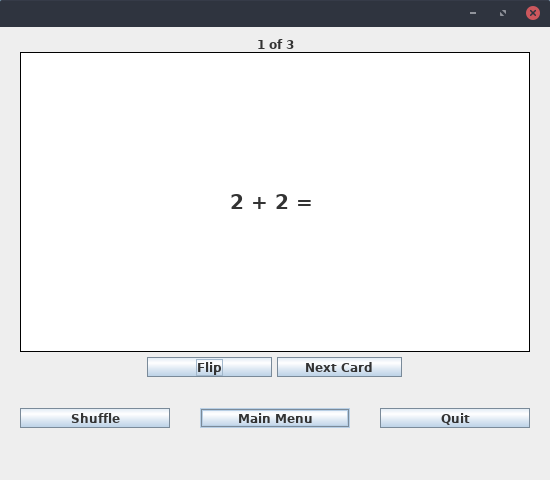

# cs56-utilities-flashcards

Shany Yeshanov and Chad Simmons

Updated By: Brian Lim and Christopher Alsheikh

[Javadoc](https://christopheralsheikh.github.io/cs56-utilities-flashcards/javadoc/index.html)

## FlashCard Simulator to help study Flashcards. Includes:

- Create your own cards with custom input
- Shuffle deck to randomize card order
- Flip cards to the back and front
- View the next card in the deck
- Save decks of cards to load later

## Modes:
### Study mode: Review and flip cards to become familiar with the information on them.

### Quiz mode: Review a deck of incorrect cards and keep a running number of how many were answered correct so far.

# F17 Final Remarks:
This is a relatively unedited legacy code project compared to the others. I believe we might be the first team besides the creators to work on this project. There is still a lot of work to be done, with a lot of refactoring with the various inner classes. To get started on the code, make sure you know how all the classes are linked. That was the hardest part for us when starting work on this project.

One of the features we would like to see in the future is a more robust answer checking system. Currently, all it does is get rid of casing and compare to see if the strings are equal. Another thing is that this app would be really useful on Android, and porting it over to that, while ambitious, seems like the direction this project is heading right now.

There is one bug that might hinder progress when working on this project. If the quiz mode does not show up, comment out all code in the Quiz related classes that have to do with sound. We are not sure why this happens.

# W18 final remarks

The project is a very simple flash card program, that has different modes for studying, quiz, etc.  Before you get started on the code, take a look at all the different classes, and how they relate to eachother.  I suggest using a debugger to step through as you are using it to get a better understanding of how things work.

Features that could be added would be a better interface with the program.  It's very bland, and grey.  Could use some color, and some razzle dazzle.  Make studying fun!  Also this would be valuable to have on other devices like android, or even make it accessable though the web.

A large bug to consider: When multiple choice mode is active during a quiz (can only occur if there are more than 4 cards), the first 4 cards are predetermined.  This can be seen by what the answers are for the first question.  The following cards in the quiz will be the front sides to the answers of the first question.  
