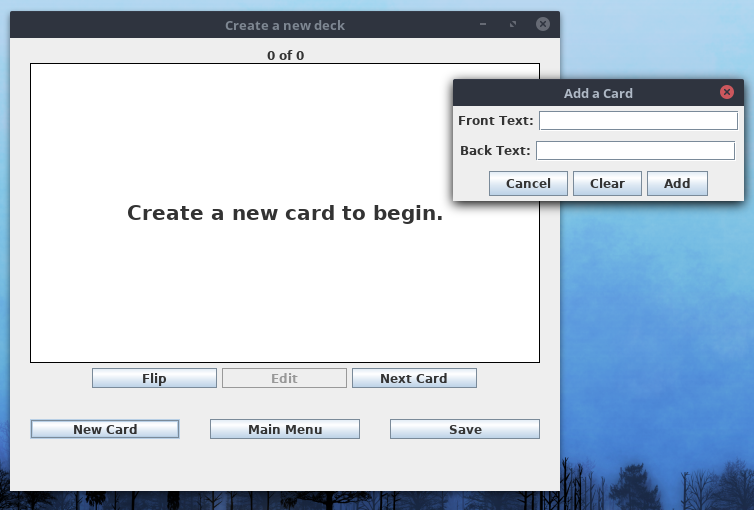
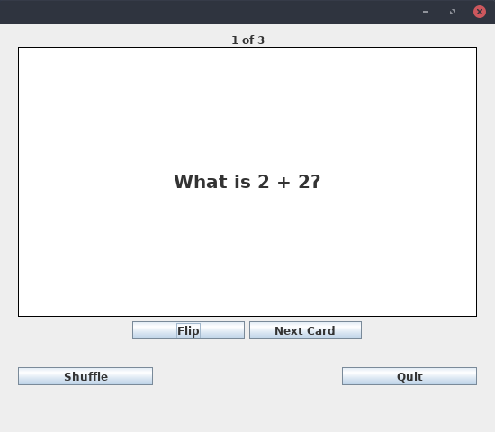
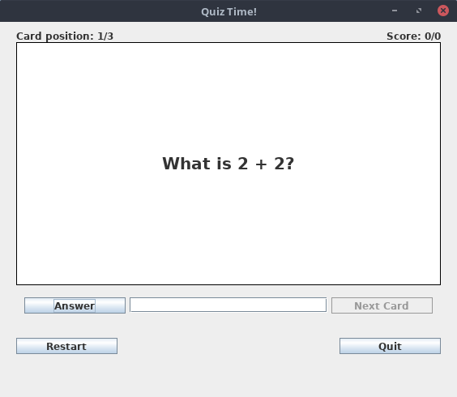

# cs56-utilities-flashcards

Shany Yeshanov and Chad Simmons
Updated By: Brian Lim and Christopher Alsheikh

## FlashCard Simulator to help study Flashcards. Includes:
- create cards

- shuffle cards 
- flip cards to the back and front
- view next card
-save decks of cards

## Modes:
### Study mode: Review and flip cards to become familiar with the information on them.

### Quiz mode: Review a deck of incorrect cards and keep a running number of how many were answered correct so far.

